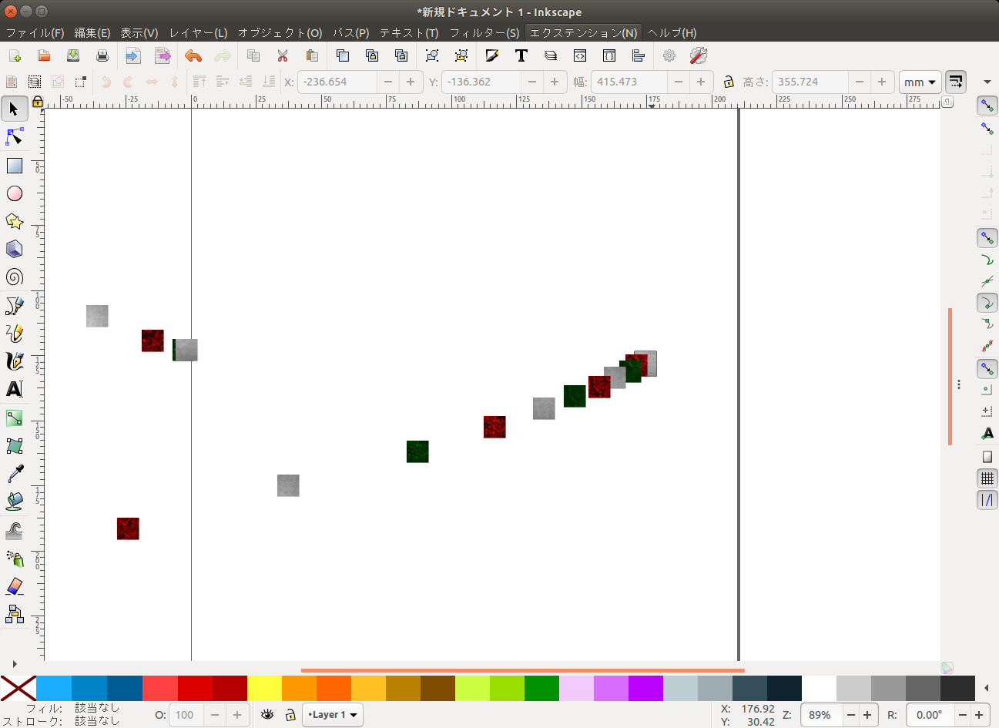
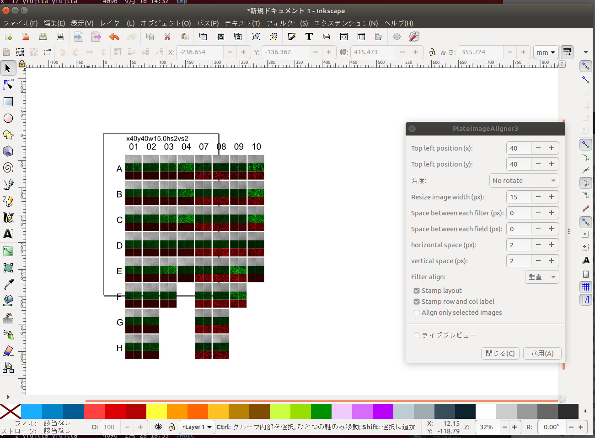

# image_aligner
Inkscape extension for aligning images

A1-fname-filtername, A2-fname-filtername などの形式のファイルを順番に並べるextension

## install

platealign3.inx と platealign3.py の2つのファイルをinkscapeのextensionフォルダにコピーしてください。

### Linux

```console
cp platealign3.inx platealign3.py ~/.config/inkscape/extensions/
```

### Mac OS

パッケージの内容を表示して
```
/Applications/Inkscape.app/Contents/Resources/share/inkscape/extensions 
```
フォルダに 
```
platealign3.inx platealign3.py
```
をコピーする。

### windows

```
%APPDATA%\Inkscape\extensions
```
フォルダに
```
platealign3.inx platealign3.py
```
をコピーする。


## 使い方

1. 画像を**埋め込みではなくリンク**でinkscapeに取り込む。
ファイル名から配置を決定しているので、ファイル名が消失する埋め込み画像は整列できません。
「画像のプロパティ」の「URL」、または「オブジェクトのプロパティ」の「ラベル」にファイル名(A1-xxxx のような文字列)がなければ整列できません。
埋め込み画像でも「オプジェクトのプロパティ」の「ラベル」にファイル名をコピーしていれば動作します。

 * ファイル名が適切であれば蛍光写真以外も並べることが出来ます。



2. Inkscape のエクステンション(Extensions)から画像(Images)-> platealign3 を選択してください。

3. 表示されるパネルに適当に数値を入れ適用をクリックしてください。




* Top left position (x): 一番左上の画像の左上端のx位置
* Top left position (y):  一番左上の画像の左上端のy位置
* 角度(angle): 90, 180, 270度回転させる
* Resize image width (px): 横幅のpixel数を指定する
* Space between each fileter (px): 各フィルタの画像間のスペース
* Space between each filed (px): 各フィールドの画像間のスペース
* horizontal space (px): ウェルの横の間のスペース
* vertical space (px): ウェルの縦の間のスペース
* Filter align: 各フィルタの画像の並び方向(vertical or horizontal)
* Stamp layout: 並べたときの設定情報を記載する
* Stamp row and col label: ウェル番号(A, B, C..., 1, 2, 3...)を記載する
* Align only selected images: 選択した画像だけ整列させる

> [!NOTE]
> x, y と実際のinkscapeとの座標がずれている場合は「ドキュメントのプロパティ」=> 「表示」の単位をすべて 「px」にして、尺度(scale)を1にしてください。

> [!NOTE]
> フィルタの名前と順番は ~/.config/platealign/config.yaml で設定できます。
> また、検索するファイル名も設定可能です。
```
regexp:
  - ^.*?(?P<ROW>[A-Z])-(?P<COL>\d+)_fld_(?P<FLD>\d+)_wv_(?P<FLT>[^.]+).*$
  - ^.*?(?P<ROW>[A-Z])%20-%20(?P<COL>\d+)\(fld%20(?P<FLD>\d+)%20wv%20(?P<FLT>[^)]+).*$
  - ^.*?(?P<ROW>[A-Z])(?P<COL>\d+)-W\d+-P(?P<FLD>\d+)-Z(?P<ZPOS>\d+)-T(?P<TIME>\d+)-(?P<FLT>[^.]+)
filters:
  - CH1
  - GC
  - PH
  - BF
  - DIA
```
